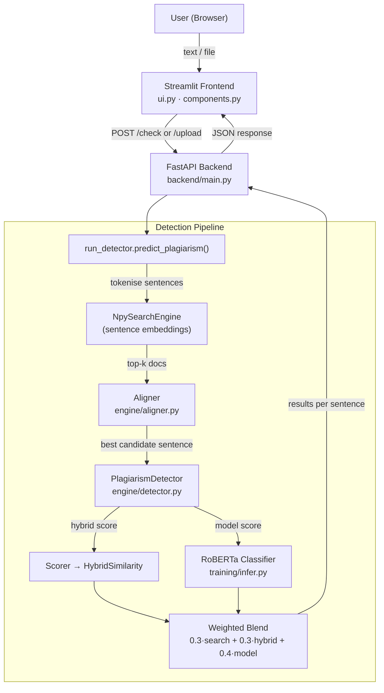

# PlagiarismGuard

> **AI-powered plagiarism detection** — sentence-level analysis combining semantic search, hybrid similarity scoring, and a fine-tuned RoBERTa classifier, served through a FastAPI backend and a Streamlit frontend.

---

## Table of Contents

- [Overview](#overview)
- [Features](#features)
- [Architecture](#architecture)
- [Project Structure](#project-structure)
- [Tech Stack](#tech-stack)
- [Getting Started](#getting-started)
  - [Prerequisites](#prerequisites)
  - [Installation](#installation)
  - [Data Setup](#data-setup)
  - [Running the App](#running-the-app)
- [API Reference](#api-reference)
- [How It Works](#how-it-works)
  - [Detection Pipeline](#detection-pipeline)
  - [Scoring Formula](#scoring-formula)
  - [Similarity Metrics](#similarity-metrics)
- [Training](#training)
  - [Fine-tuning the Classifier](#fine-tuning-the-classifier)
  - [Building ArXiv Embeddings](#building-arxiv-embeddings)
- [Testing](#testing)
- [Configuration](#configuration)
- [License](#license)

---

## Overview

PlagiarismGuard analyses input text at the **sentence level** against a corpus of ~272 000 ArXiv AI abstracts. Each sentence is:

1. **Searched** against pre-built sentence embeddings (cosine similarity).
2. **Aligned** to the best-matching candidate sentence in each retrieved document.
3. **Scored** using four hybrid similarity metrics.
4. **Classified** by a RoBERTa model fine-tuned on the Microsoft Research Paraphrase Corpus (MRPC).

The three scores are blended into a final plagiarism probability and an overall document score is reported to the user through a rich Streamlit dashboard.

---

## Features

- Sentence-level plagiarism detection with per-sentence scores and predictions
- Hybrid similarity: TF-IDF cosine · n-gram Jaccard · sequence LCS · semantic (BERT)
- Fine-tuned RoBERTa classifier (MRPC paraphrase dataset)
- Semantic search over 272 k ArXiv abstracts via pre-computed embeddings
- Support for plain text, PDF, DOCX, and Markdown file uploads
- Interactive Streamlit UI with score card, source cards, donut chart, bar chart, and timeline chart
- FastAPI REST backend with `/check`, `/upload`, and `/health` endpoints
- Colour-coded severity badges and highlighted text output

---

## Architecture



---

## Project Structure

```
Plagiarism-Guard/
│
├── Frontend/                   # Streamlit frontend
│   ├── ui.py                   # Page layout and user interaction
│   ├── components.py           # Reusable UI components (charts, cards)
│   ├── api_client.py           # HTTP client for the FastAPI backend
│   ├── utils.py                # Pure helper functions (colours, labels, formatting)
│   └── styles.css              # Custom CSS
│
├── backend/                    # FastAPI backend
│   ├── main.py                 # Routes, request models, response builder
│   └── file_parser.py          # PDF / DOCX / TXT text extraction
│
├── engine/                     # Core detection engine
│   ├── detector.py             # Orchestrates matching, scoring, and classification
│   ├── aligner.py              # Finds best-matching sentence in a candidate doc
│   ├── matcher.py              # Pairs query sentences with retrieved documents
│   └── scorer.py               # Runs HybridSimilarity on each pair
│
├── similarity/                 # Similarity metrics
│   ├── cosine.py               # TF-IDF cosine similarity
│   ├── ngram.py                # N-gram Jaccard similarity (n=3)
│   ├── semantic.py             # Sentence-BERT cosine similarity
│   ├── sequence.py             # Longest common subsequence ratio
│   └── hybrid_similarity.py    # Weighted blend of all four metrics
│
├── search/                     # Retrieval layer
│   ├── indexer.py              # Encodes documents with sentence-transformers
│   ├── ranker.py               # Sorts results by score
│   └── search_engine.py        # Semantic + n-gram hybrid search
│
├── preprocessing/              # Text preprocessing utilities
│   ├── cleaner.py              # Lowercase + strip non-alpha characters
│   ├── lemmatizer.py           # WordNet lemmatisation
│   ├── stopwords.py            # Stopword removal
│   ├── Tokenizer.py            # Sentence and word tokenisation
│   ├── normalizer.py           # Full preprocessing pipeline
│   └── download_nltk.py        # Download required NLTK data
│
├── training/                   # Model training scripts
│   ├── training_model.py       # Fine-tune RoBERTa on MRPC
│   ├── infer.py                # Load saved model and run inference
│   └── arxiv_embedding_model.py# Encode ArXiv corpus with sentence-transformers
│
├── tests/                      # Tests and demo scripts
│   ├── test_similarity.py      # Unit tests for all similarity metrics
│   ├── test_engine.py          # Unit tests for the detection engine
│   └── sentence_corpus.py      # End-to-end demo on a sample paragraph
│
├── data/
│   └── procressed/
│       ├── arxiv_docs.json     # Preprocessed ArXiv documents
│       └── arxiv_embeddings.npy# Pre-computed sentence embeddings
│
├── preprocessing/
│   └── pandas.ipynb            # ArXiv dataset cleaning notebook
│   └── pandasmsr1.ipynb        # MRPC train set preprocessing notebook
│   └── pandasmsr2.ipynb        # MRPC test set preprocessing notebook
│
├── run_detector.py             # CLI entry point + module API (predict_plagiarism)
├── prepros.py                  # Quick data inspection script
└── requirements.txt            # Python dependencies
```

---

## Tech Stack

| Layer | Technology |
|---|---|
| Frontend | Streamlit 1.35, Plotly 5.22 |
| Backend API | FastAPI, Uvicorn, Pydantic |
| ML Classifier | RoBERTa (`roberta-base`) via HuggingFace Transformers 4.41 |
| Semantic Search | `sentence-transformers` 2.7 · `all-MiniLM-L6-v2` |
| Similarity | scikit-learn 1.5 (TF-IDF, cosine) · NLTK 3.9 · difflib |
| File Parsing | pdfplumber · python-docx |
| Data | numpy ≥ 1.26 · pandas · scipy ≥ 1.11 |
| Testing | pytest ≥ 8.2 |
| Training data | [ArXiv dataset](https://www.kaggle.com/datasets/Cornell-University/arxiv) · [MRPC](https://www.microsoft.com/en-us/download/details.aspx?id=52398) |

---

## Getting Started

### Prerequisites

- Python **3.10+**
- CUDA-capable GPU *(optional but recommended for embedding generation and training)*
- ~4 GB disk space for the ArXiv corpus and embeddings

### Installation

```bash
# 1. Clone the repository
git clone https://github.com/<your-username>/Plagiarism-Guard.git
cd Plagiarism-Guard

# 2. Create and activate a virtual environment
python -m venv .venv
# Windows
.venv\Scripts\activate
# macOS / Linux
source .venv/bin/activate

# 3. Install core dependencies
pip install -r requirements.txt

# 4. Install backend dependencies
pip install fastapi uvicorn pdfplumber python-docx

# 5. Install frontend dependencies
pip install -r Frontend/requirements.txt

# 6. Download required NLTK data
python preprocessing/download_nltk.py
```

### Data Setup

> **Skip this section** if you already have `data/procressed/arxiv_docs.json` and `data/procressed/arxiv_embeddings.npy`.

#### 1 — Prepare the ArXiv corpus

Download the [ArXiv dataset](https://www.kaggle.com/datasets/Cornell-University/arxiv) and place `arxiv-metadata-oai-snapshot.json` (lines format) inside `preprocessing/`. Then run the `pandas.ipynb` notebook to produce `arxiv_docs.json`.

#### 2 — Build sentence embeddings

```bash
python -m training.arxiv_embedding_model
```

This encodes all documents with `all-MiniLM-L6-v2` and saves `data/procressed/arxiv_embeddings.npy`. Requires ~2 GB RAM; GPU is strongly recommended.

#### 3 — Place the fine-tuned classifier

The classifier must be saved at `training/saved_models/saved_model/`. See [Training](#training) if you need to train it from scratch.

### Running the App

Open **two terminals** from the project root.

**Terminal 1 — Start the FastAPI backend:**

```bash
uvicorn backend.main:app --host 127.0.0.1 --port 5000
```

**Terminal 2 — Start the Streamlit frontend:**

```bash
cd Frontend
streamlit run ui.py
```

Then open [http://localhost:8501](http://localhost:8501) in your browser.

#### CLI usage (no frontend required)

```bash
# Analyse a text string
python run_detector.py "Deep learning is a subset of machine learning."

# Pipe text from a file
python run_detector.py "$(cat my_essay.txt)" --top-k 10
```

---

## API Reference

The backend runs at `http://127.0.0.1:5000` by default.

### `GET /health`

Returns `{"status": "ok"}` when the server is reachable.

---

### `POST /check`

Analyse a plain-text string.

**Request body**

```json
{ "text": "Your text to analyse goes here." }
```

**Response**

```json
{
  "score": 72,
  "word_count": 120,
  "sentence_count": 8,
  "unique_phrases": 14,
  "sources": [
    { "title": "arxiv_1042", "domain": "arxiv_1042", "url": "#", "score": 0.91, "excerpt": "..." }
  ],
  "highlighted_text": "Original sentence. <mark class=\"plagiarized\">Flagged sentence.</mark>",
  "chart_data": {
    "matched": 72,
    "original": 28,
    "source_breakdown": [{ "label": "arxiv_1042", "value": 91.0 }],
    "similarity_timeline": [{ "segment": 1, "similarity": 45.3 }]
  },
  "results": [ ... ]
}
```

---

### `POST /upload`

Upload a PDF, DOCX, or TXT file for analysis.

**Request** — `multipart/form-data` with a `file` field.

**Response** — Same shape as `/check`, wrapped under `{ "filename": "...", "result": { ... } }`.

---

## How It Works

### Detection Pipeline

```
Input text
    │
    ├─ sent_tokenize()          → individual sentences
    │
    └─ For each sentence:
          │
          ├─ NpySearchEngine.search()   → top-k similar documents (cosine via dot product)
          ├─ Aligner.best_matching_sentence()  → closest sentence within each doc
          ├─ Scorer → HybridSimilarity.compute()   → 4 similarity scores
          ├─ training/infer.predict()   → plagiarism probability from RoBERTa
          └─ Weighted blend → final_score + prediction label
```

### Scoring Formula

```
final_score = 0.3 × search_score
            + 0.3 × hybrid_score
            + 0.4 × model_score
```

A sentence is flagged as **plagiarism** when `final_score ≥ 0.6`.

The **overall document score** is the average `final_score × 100` across all sentences.

### Similarity Metrics

| Metric | Method | Weight in hybrid |
|---|---|---|
| TF-IDF Cosine | `sklearn.TfidfVectorizer` + cosine similarity | 30% |
| N-gram Jaccard | Trigram set intersection ÷ union | 20% |
| Sequence ratio | `difflib.SequenceMatcher` LCS ratio | 20% |
| Semantic (BERT) | `all-MiniLM-L6-v2` sentence embeddings cosine | 30% |

---

## Training

### Fine-tuning the Classifier

The classifier is a `roberta-base` model fine-tuned for binary sequence-pair classification (paraphrase = plagiarism, non-paraphrase = original) on the MRPC dataset.

**1 — Preprocess MRPC data**

Run the notebooks `preprocessing/pandasmsr1.ipynb` (train) and `preprocessing/pandasmsr2.ipynb` (test) to produce:

- `data/procressed/mrpc_train_clean.csv`
- `data/procressed/mrpc_test_clean.csv`

**2 — Train**

```bash
python -m training.training_model
```

Training arguments (editable in `training/training_model.py`):

| Parameter | Default |
|---|---|
| Base model | `roberta-base` |
| Max sequence length | 128 |
| Learning rate | 2e-5 |
| Epochs | 3 |
| Batch size | 16 |
| Optimiser metric | F1 score |
| Mixed precision | fp16 |

The best checkpoint is saved to `training/saved_models/saved_model/`.

### Building ArXiv Embeddings

```bash
python -m training.arxiv_embedding_model
```

Encodes all documents in `data/procressed/arxiv_docs.json` with `all-MiniLM-L6-v2` (batch size 256) and saves the result as a float32 `.npy` matrix. Embeddings are **not** normalised at this stage — normalisation is applied at search time for cosine similarity.

---

## Testing

```bash
# Run all tests from the project root
pytest tests/

# Run similarity unit tests only
pytest tests/test_similarity.py -v

# Run engine unit tests only
pytest tests/test_engine.py -v
```

**End-to-end demo** (no pytest required):

```bash
python tests/sentence_corpus.py
```

Runs the full pipeline on a sample ArXiv paragraph and prints a per-sentence summary table.

---

## Configuration

| Variable / constant | Location | Description |
|---|---|---|
| `BASE_URL` | `Frontend/api_client.py` | Backend URL (default `http://127.0.0.1:5000`) |
| `TIMEOUT_SECONDS` | `Frontend/api_client.py` | Request timeout in seconds (default 600) |
| `threshold` | `engine/detector.py` | Minimum score to flag a sentence (default 0.6) |
| `DOCS_PATH` / `EMB_PATH` | `run_detector.py` | Paths to the ArXiv corpus and embeddings |
| `Model_Name` | `training/training_model.py` | HuggingFace model ID for fine-tuning |
| `Max_Length` | `training/training_model.py` | Token sequence length (default 128) |
| `MODEL_NAME` | `training/arxiv_embedding_model.py` | Sentence-transformer model for embedding |
| `BATCH_SIZE` | `training/arxiv_embedding_model.py` | Embedding batch size (default 256) |

---

## License

This project is released under the [MIT License](LICENSE).

---

<p align="center">Built with Python · FastAPI · Streamlit · HuggingFace Transformers</p>
